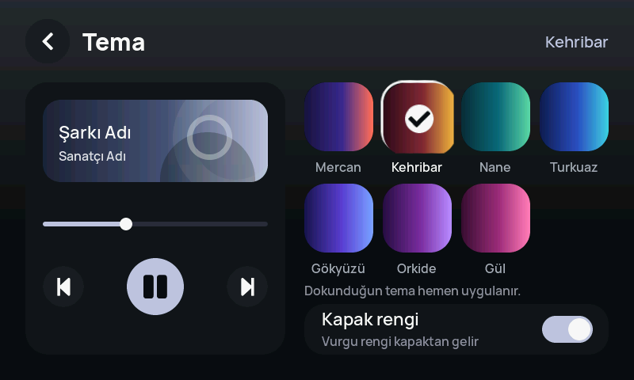

# Masa Paneli — CrowPanel YouTube Music Desk Panel

A dedicated desk-side display for controlling YouTube Music (and glancing at your PC's vitals) while
gaming, built on an [Elecrow CrowPanel Advance 4.3" HMI](https://www.elecrow.com/) and a small Windows
helper that bridges the panel to the PC over USB serial.



## What it does

- **Now playing**: title/artist, cover art, seek bar, play/pause, previous/next, ±10s skip, shuffle/repeat
  — driven from Windows' System Media Transport Controls (SMTC), so it works with any app that reports
  now-playing info, with a Chrome extension bridge specifically for YouTube Music's like/shuffle shortcuts
  that SMTC doesn't expose.
- **System monitor**: CPU/GPU load, RAM/VRAM, network throughput and latency.
- **Timer**: countdown and Pomodoro modes.
- **Break reminder**: hourly or session-based nudges to take a break.
- **Weather + clock** on the idle screen (Turkish State Meteorological Service, IP-based location by
  default).
- **7 selectable color themes**, or an accent color derived live from the current track's cover art.
- Entirely Turkish UI (this was a hard requirement of the project).

## Hardware

| | |
|---|---|
| Board | Elecrow CrowPanel Advance 4.3" HMI, hardware revision V1.3 |
| MCU | ESP32-S3-WROOM-1-N16R8 (dual-core LX7, 512KB SRAM + 8MB PSRAM, 16MB flash) |
| Display | 4.3" IPS, 800×480, RGB565, ST7265 driver, GT911 capacitive touch |
| Host link | USB-C → CH340K USB-UART bridge (**not** a native USB HID device — the ESP32-S3's own USB
  data lines aren't wired to the connector on this board, so the panel talks to the PC purely over a
  serial protocol, not as a keyboard/media-key device) |

## Repository layout

```
panel-firmware/    ESP32-S3 firmware (ESP-IDF, C, LVGL 9)
  main/              UI (ui.c), board bring-up (board.c), PC protocol (proto.c),
                      captive-portal Wi-Fi install flow (portal.c), themes, settings, Turkish strings
  components/        Small local components (e.g. dns_server for the install captive portal)
pc-helper/         Windows-side Python helper + Chrome extension
  panel_helper.py    Resident helper: bridges SMTC, system stats, weather, notifications to the panel
  chrome-eklenti/    Chrome extension (YouTube Music like/shuffle bridge over local WebSocket)
  kur.ps1            Self-installer (Python venv, packages, Windows autostart, Chrome extension setup)
  bootstrap/         Tiny USB-serial bootstrap script (for PCs with no Wi-Fi) — published standalone
font-tools/        Font subsetting pipeline that generates panel-firmware/main/fonts/*.c
```

## Building the firmware

Requires [ESP-IDF](https://docs.espressif.com/projects/esp-idf/) (developed against v6.1) with the
ESP32-S3 target.

```
cd panel-firmware
idf.py set-target esp32s3
idf.py build
idf.py -p <COM-port> flash
```

Bump the version string in `main/fw_version.h` before every new flash — the PC helper uses it to decide
whether to push a firmware update to the panel automatically.

## Running the PC helper

```
cd pc-helper
python -m venv .venv
.venv\Scripts\pip install -r requirements.txt
.venv\Scripts\python panel_helper.py
```

Or just run `kur.bat` from a released package, which sets up the venv, installs the Chrome extension,
and registers itself to start with Windows — no admin rights required.

## Why USB serial and not USB HID?

The board's USB-C data lines are wired to a CH340K USB-UART chip, not to the ESP32-S3 directly (confirmed
from the V1.3 schematic), so the panel can't present itself as a keyboard/media-key device. Instead, the
Windows helper reads Windows' own media session state and pushes it to the panel over a small
tab-separated serial protocol, and the panel sends button presses back the same way.

## License

MIT — see [LICENSE](LICENSE).
